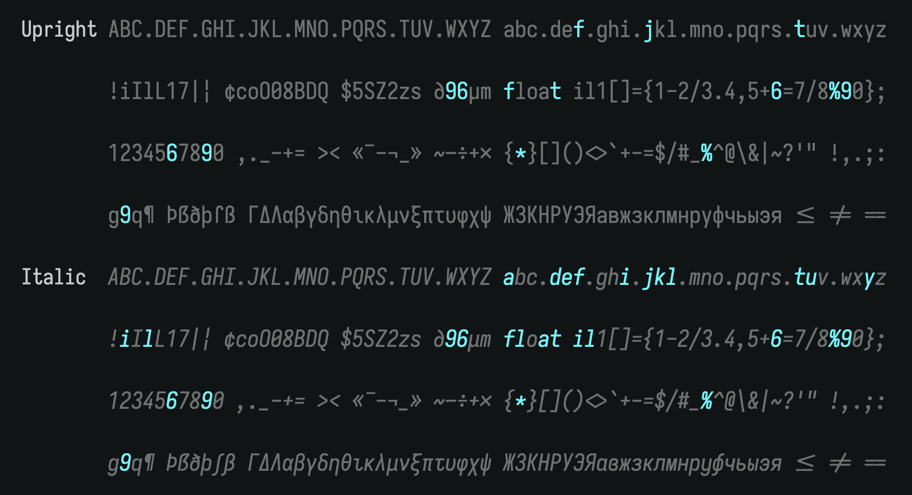

# iosevka-n

My custom [Iosevka](https://typeof.net/Iosevka/) build pipeline.


*Previewed via Iosevka's online customizer.*

## Trigger a build

```bash
gh workflow run build.yml                               # build v34.5.0 by default
gh workflow run build.yml -f iosevka_version=v33.3.3    # build a specific version
gh run watch                                            # follow the run
```

Each release ships 3 hinted TTF tarballs: `iosevka-n`, `iosevka-n-term`, `iosevka-n-quasi-proportional`.
Releases are tagged `<iosevka_version>-<short_sha>` (e.g. `v34.5.0-a1b2c3d`).

## Tarball layout

Each tarball is flat: `.ttf` files at the root plus upstream's `OFL.txt`, no nested directory.

```
$ tar -tzf iosevka-n-v34.5.0.tar.gz | head -5
./
./iosevka-n-Bold.ttf
./iosevka-n-BoldItalic.ttf
./iosevka-n-Italic.ttf
./OFL.txt
```

## Local build

```bash
nix develop
bash scripts/build-family.sh iosevka-n v34.5.0
bash scripts/package-family.sh iosevka-n v34.5.0
ls dist/iosevka-n-v34.5.0.tar.gz
```

## Using from Nix

These releases are consumable via `fetchurl`.
My own [nix-config](https://github.com/nbetm/nix-config/tree/main/pkgs/iosevka-n) does it this way.

Bumping to a new release:

1. Set `release` in `pkgs/iosevka-n/sources.nix` to the new tag.
1. Set each entry's `sha256` to `"sha256-AAAAAAAAAAAAAAAAAAAAAAAAAAAAAAAAAAAAAAAAAAA="`.
1. Build all three with `--keep-going` to catch every hash mismatch at once:
   ```bash
   nix build --keep-going \
     .#nixosConfigurations.aura.pkgs.iosevka-n{,-term,-quasi-proportional}
   ```
1. Paste each `got: sha256-...` from the error output back into `sources.nix`.

## Licensing

- Iosevka fonts (including these tarballs) are **OFL-1.1**, same as upstream `be5invis/iosevka`. Each tarball bundles `OFL.txt`.
- This repository's scripts and workflow are **MIT** (see `LICENSE`).
- The `get-all-families-in-private-build-plan/` helper is vendored from `be5invis/iosevka-custom-build-demo`, also **MIT** (see `THIRD_PARTY_LICENSES.md`).
